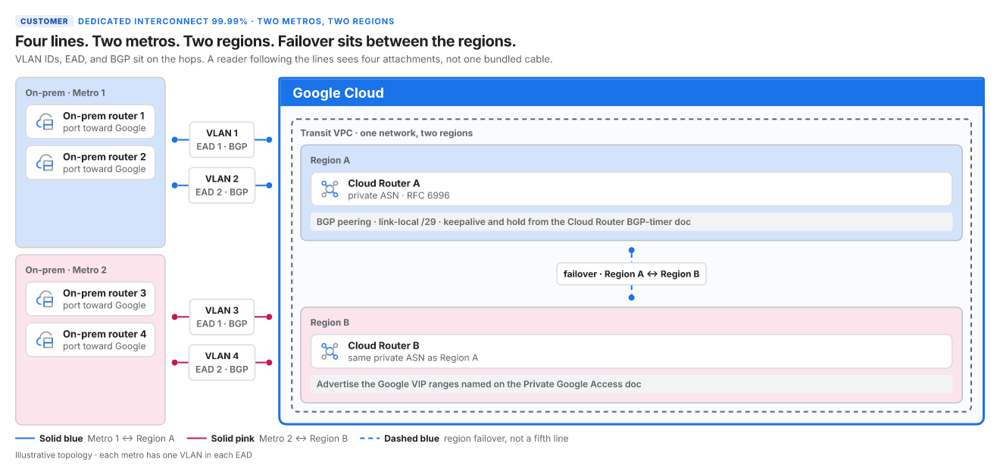
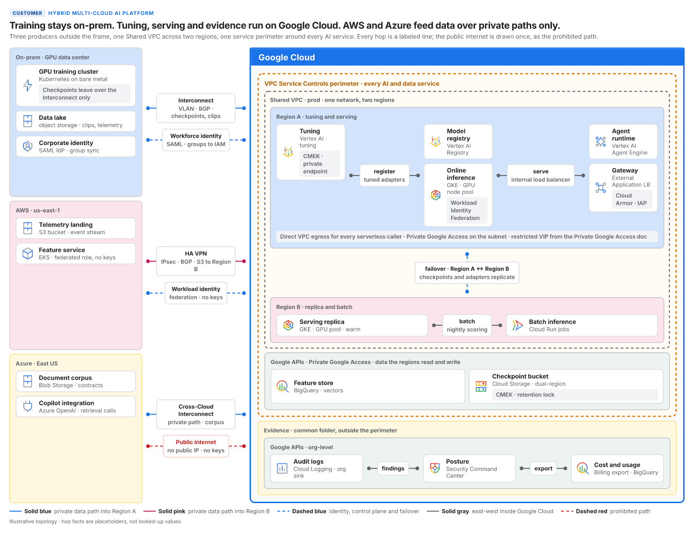
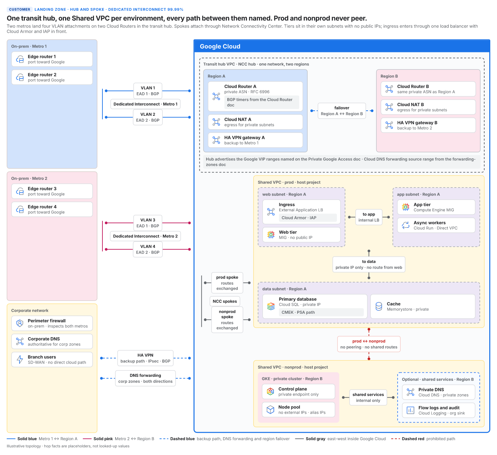
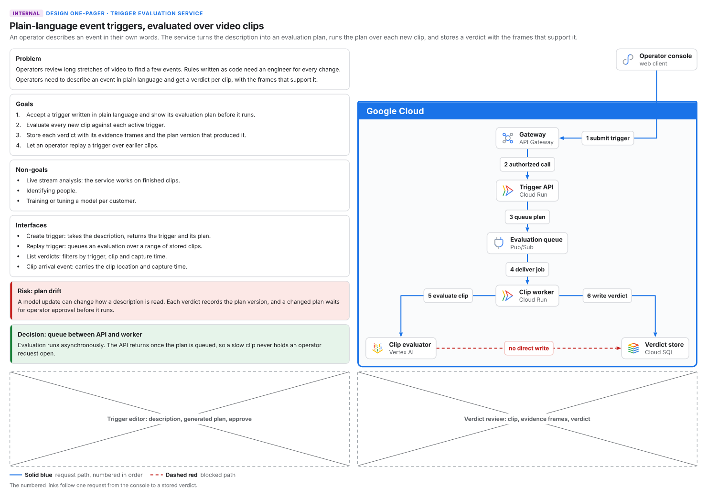
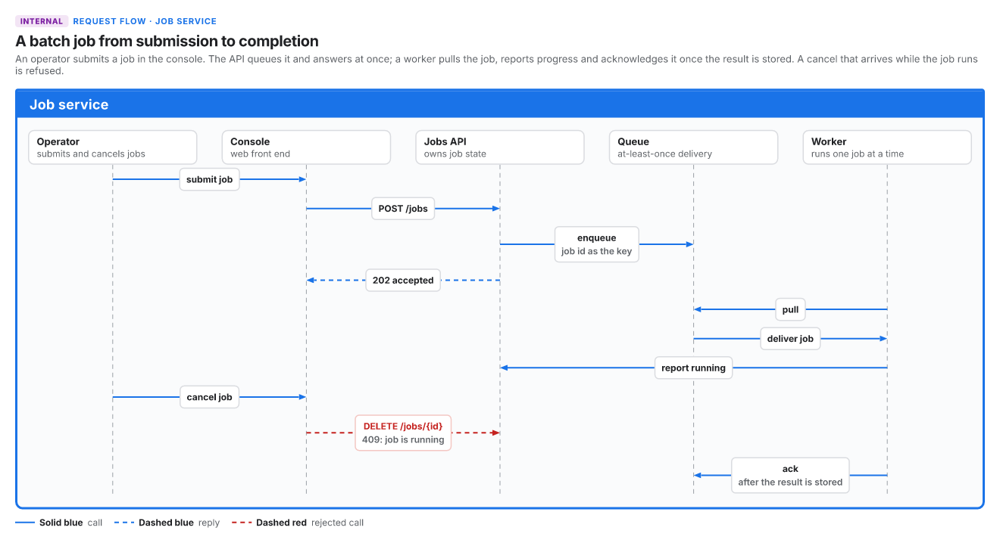
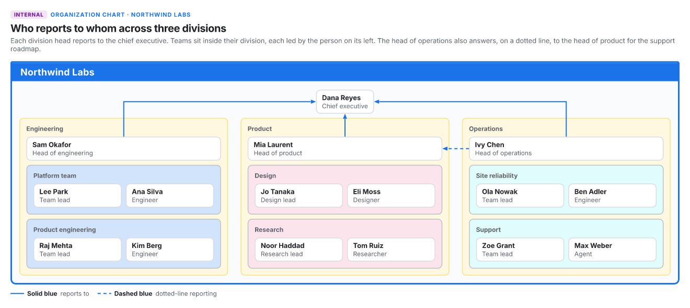
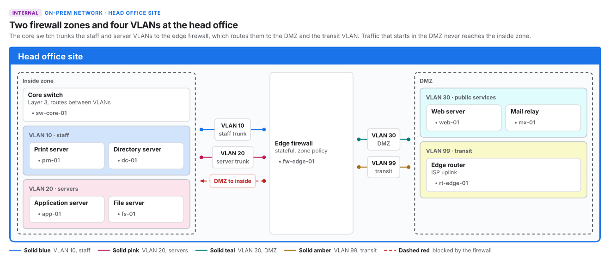

# stencil

Stencil turns a JSON description of an architecture figure into an SVG, a PNG and a measured JSON. The document describes structure only: boxes, items, facts, notes and the labeled pipes and links between them. It carries no coordinates. taffy computes every box, cosmic-text measures every string with the Inter font files bundled in this repository, and resvg renders with the same files, so a measured width is the rendered width. The contract is `docs/SPEC.md`.

The vocabulary splits into a core and grammars (`docs/SPEC.md` section 13). The core is what every figure shares: `Row`, `Col`, `Lanes`, a generic container `Box`, a generic named leaf `Item` with facts whose `source` is `doc`, `built` or `ask`, notes and text blocks, and pipes, tees and links drawn with a `line` (`gray`, `solid`, `dash`, `deny`) and an optional `tint` slot 1 to 8. A grammar is a data module that gives a domain its kinds: which container kinds a `Box` may take, how each is drawn, where each may sit, which item kinds exist and which icons they carry. Two grammars ship. `gcp`, the default, is the Google Cloud Architecture Center vocabulary (`gcp`, `vpc`, `region`, `subnet`, `onprem`, `project`, `optional`, `k8s`, `perimeter`, `apis`, and the `product` item). `plain` is domain-neutral (`system`, `boundary`, `group`, `tile`, and the items `service`, `store`, `external`, `person`). A `Lanes` node lays its children out as lane heads, and a link with `order` between two of them is a message drawn across the band below, in order, with a lifeline under each head. A page names its grammar with `"grammar"`, a built-in name or a path to a grammar `.json` file beside the document.

Build the binary with `cargo build --release`; it lands at `target/release/stencil`.

## Examples



`examples/g7.json`: four Dedicated Interconnect VLAN attachments from two metros into two regions, with failover between the regions.



`examples/hybrid-ai.json`: training on-prem, tuning and serving on Google Cloud, AWS and Azure feeding data over private paths.



`examples/network-hub-spoke.json`: a transit hub with one Shared VPC per environment and every path between them labeled.



`examples/onepager.json`: a design one-pager with text blocks, callouts and numbered links tracing one request.

The next three figures use the `plain` grammar.



`examples/sequence.json`: a request flow as five lanes with ten ordered messages, among them a reply and a rejected call; authored in `cue/figures/sequence.cue`.



`examples/org.json`: an organization chart with divisions as tiles, teams as tinted groups of people, and reporting links.



`examples/onprem-network.json`: an on-prem site with two firewall zones, a tinted group and a pipe per VLAN, and a blocked path between the zones.

These PNGs are the center theme at scale 1, regenerated with `mise run gallery-docs`; CI fails when they drift from the examples. The full gallery, every example in all three themes with its SVG, 2x PNG and measured JSON, is the `gallery` artifact of the CI run on main, and `gallery.zip` plus the center PNGs are attached to the release of every `v*` tag.

## Commands

An agent runs `stencil prime` first. It prints a briefing of about 1,500 tokens: the authoring loop, the vocabulary with every field and enum value taken from the model, the layout rules, the checks and how to fix each defect. `stencil prime <topic>` prints one deeper section: `themes`, `links`, `blocks`, `layout`, `checks`, `cue`, or `example` (the g7 document). `stencil prime grammar <name>` prints a grammar's kinds, rendered from its data, and its rules.

```bash
stencil prime
stencil prime links
stencil prime grammar gcp
```

`stencil vet <json>` parses the document, loads its grammar, applies the vet rules (field types, text limits, container sizes, nesting depth, the grammar's kinds and where each may sit) and then runs the two checks that need no layout: remembered constants (the literals the grammar lists) and legend consistency (every line and tint in use has one legend entry).

```bash
stencil vet examples/g7.json
```

`stencil render <json> --out-dir <dir> [--scale <1-4>]` lays out the page and writes `<stem>.svg`, `<stem>.png` and `<stem>.measured.json` into the output directory, creating it when missing. It prints the three absolute paths. The PNG scale defaults to 2.

```bash
stencil render examples/g7.json --out-dir out
```

`stencil check <json>` does everything `render` does in memory, writes nothing, and runs all ten checks: child inside container, siblings do not overlap, text fits box, remembered constants, legend consistency, links routed, links avoid boxes, pipes land, and under the isometric projection iso labels clear and iso links clear.

```bash
stencil check examples/g7.json
```

`stencil schema` prints the JSON Schema of the document, the same text as `schema/stencil.schema.json`.

```bash
stencil schema > stencil.schema.json
```

`stencil gallery <out-dir> [--examples <dir>]` renders every `.json` document in `examples/` (or `--examples`) under every theme into `<out-dir>/<example>/<theme>/`, runs the checks on each render, and writes `index.html`, a static page with one section per theme, and `gallery.json` with the same data. It prints one check summary per render and the number of renders; it exits 1 when any check fails and 2 when the examples directory holds no document.

```bash
stencil gallery target/gallery
```

Every check line reports how many units it examined, and a check that examined nothing fails. The exit code is 0 when everything passed, 1 when the document has a defect (invalid JSON, a vet violation, a failing check, a character Inter lacks) and 2 when stencil could not run (bad arguments, an unreadable input, an unwritable output directory, a font or renderer fault).

## The CUE gate

Figures are authored in CUE against a grammar package. `cue/core.cue` holds the core vocabulary, `cue/grammar.cue` the `#Grammar` definition, and `cue/grammars/gcp.cue` and `cue/grammars/plain.cue` each grammar's data and the domain rules the Rust side does not evaluate, such as tint pairing and the requirement that every gcp product carries a subtitle, a doc fact or an ask. `cue/` is the module root, so the commands run from inside it. A figure passes three steps in order, and each one stops the pipeline on failure:

```bash
cd cue
cue vet -c ./figures:gcp
cue export ./figures:gcp -e customer --out json -o ../figure.json
cd .. && stencil render figure.json --out-dir out
```

`cue vet` enforces the authoring rules, `cue export` writes the structural JSON, and `stencil render` vets that JSON again before it lays out and renders. Run `stencil check figure.json` between the export and the render to see every check result before any file is written. `cue/README.md` describes the CUE packages; `cue/check.sh` re-exports both grammars and fails when either differs from the JSON the Rust side embeds (`crates/stencil-model/grammars/`), vets every example and runs the negative cases.

## Fonts and icons

The four Inter faces in `assets/fonts/` are unmodified files from the Inter 4.1 release under the SIL Open Font License 1.1, whose text ships next to them as `OFL.txt`. The Google Cloud icons in `assets/icons/` are unaltered copies from the official icon library at cloud.google.com/icons, used on labeled product items in technical figures under the terms recorded in `assets/icons/PROVENANCE.md`.
